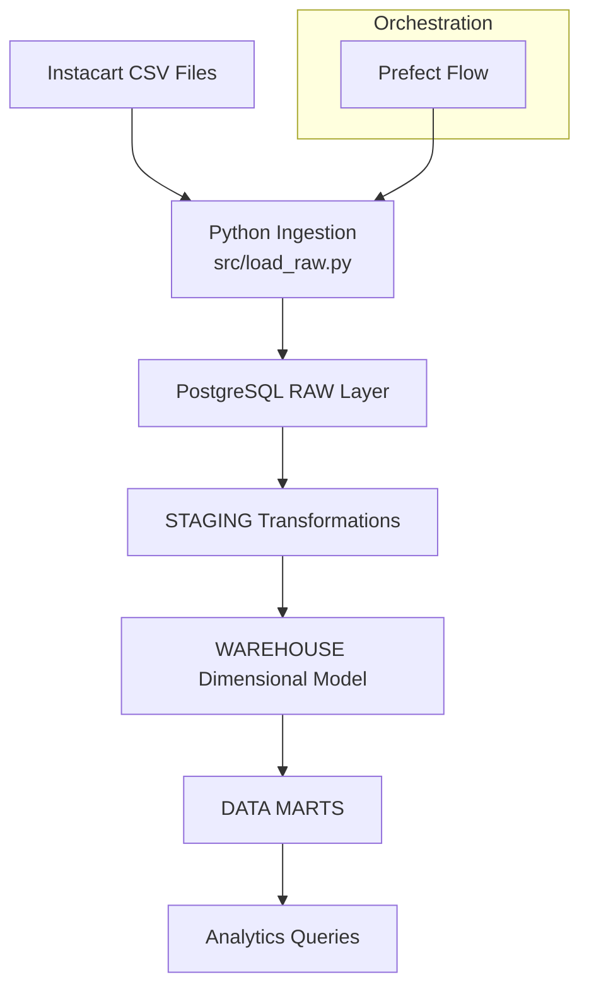
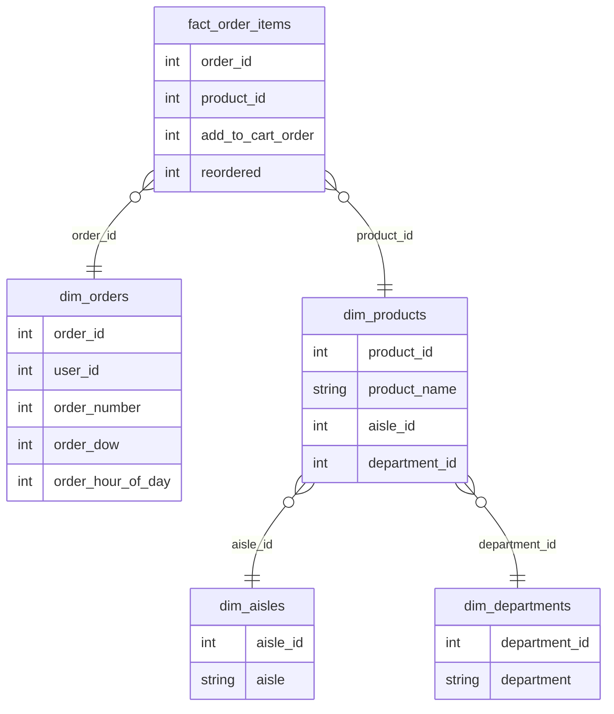

# Instacart Retail Analytics Warehouse Pipeline

This project builds an end-to-end data engineering pipeline that transforms the Instacart Online Grocery Shopping dataset into a structured PostgreSQL analytics warehouse.

The pipeline loads raw CSV data, cleans and models it, and produces analytics-ready data marts for business insights.


## Pipeline Architecture

The pipeline ingests raw Instacart CSV files, loads them into a PostgreSQL warehouse, and transforms them through layered schemas (raw → staging → warehouse → marts) orchestrated with Prefect.



## Technologies

- Python
- PostgreSQL
- SQLAlchemy
- Prefect
- Docker
- Pandas
- Dimensional Modeling

### Examples of business questions answered:

- Which products have the highest reorder probability?
- What time of day do customers shop most?
- Which departments drive the most repeat purchases?


## Project Structure

```text
config/
data/
flows/
sql/
    raw/
    staging/
    warehouse/
    marts/
src/
tests/
README.md
requirements.txt
```
---

## Data Model

The warehouse follows a dimensional model with a central fact table for order items and supporting dimension tables.


---

## Pipeline Steps

1. Create raw tables
2. Load raw CSV data
3. Transform data into staging tables
4. Build dimensional warehouse tables
5. Generate analytics marts

## Pipeline scale

```
Processes 30M+ order-item records into a dimensional warehouse.
```

---

## Dataset

Instacart Online Grocery Shopping Dataset 2017

https://www.kaggle.com/datasets/psparks/instacart-market-basket-analysis

---

## Example Analytics

The warehouse enables analysis such as:

- product reorder rates
- customer ordering behavior
- department purchasing trends
- shopping patterns by day and hour

---

## Running the Pipeline

1. Install dependencies

```
pip install -r requirements.txt
```

2. Configure database credentials

```
Create a `.env` file using `.env.example`.
```

3. Run the pipeline

```
python flows/instacart_flow.py
```
4. Using Make

```
make install
make run
```

## Pipeline Orchestration

The pipeline is orchestrated using Prefect, allowing monitoring of flow runs and task execution.


## Docker Pipeline Execution

The pipeline runs in Docker containers for reproducible local execution.

- PostgreSQL warehouse container
- Pipeline execution container


## Future Improvements

- Airflow orchestration
- Cloud deployment (Azure)
- Dashboard layer (Power BI / Metabase)