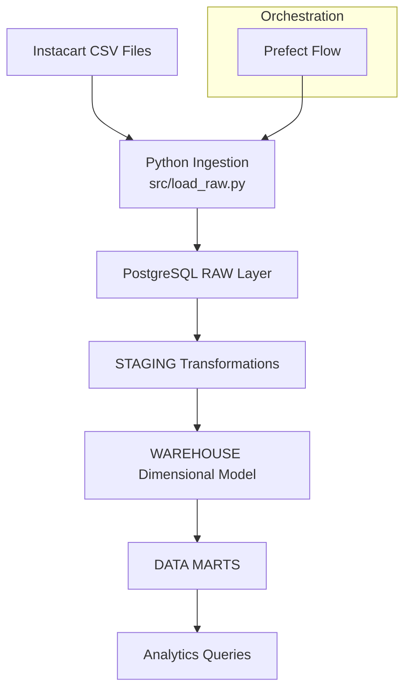
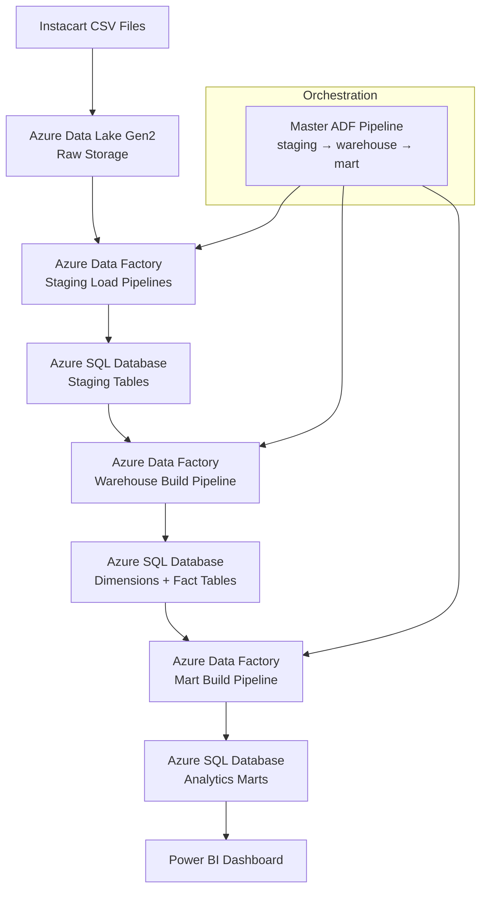
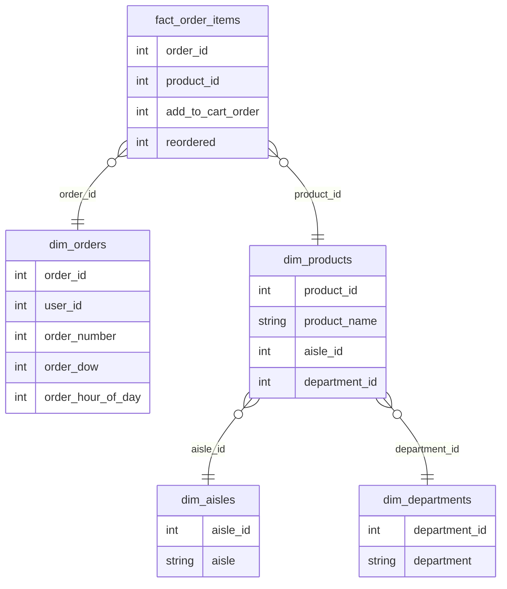
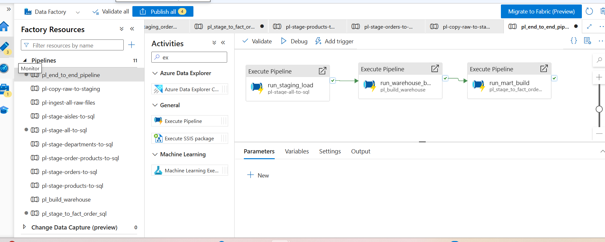
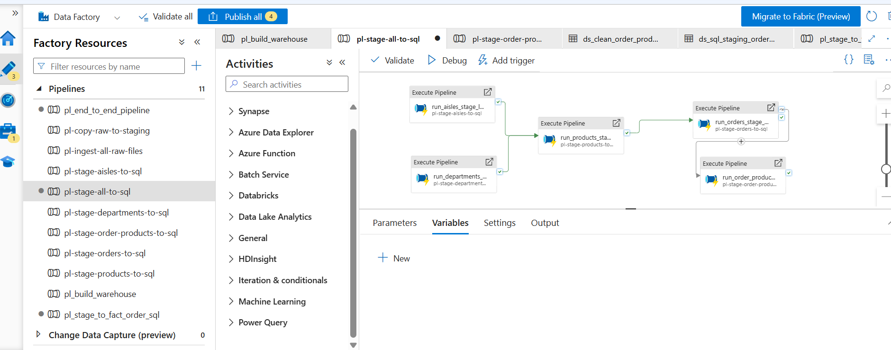
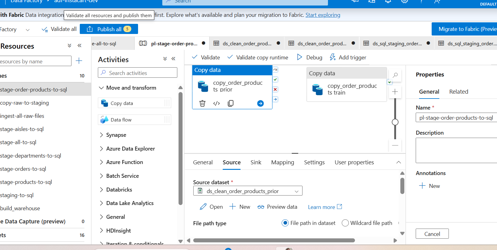
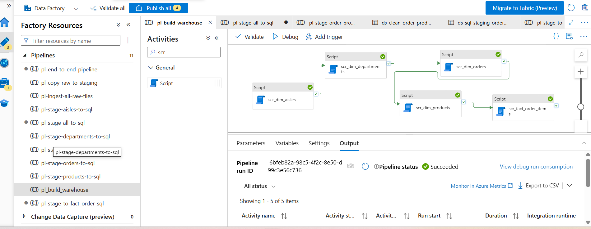

# Instacart Retail Analytics Pipeline (Azure + SQL + Power BI)

This project builds an end-to-end retail analytics pipeline to analyze customer purchasing and reorder behavior using the Instacart dataset (33M+ records).

The pipeline transforms raw transactional data into a structured analytics warehouse and business-ready dashboards, enabling insights into product demand, customer loyalty, and department-level performance.

The goal is to identify:
- Which products drive demand
- Which products drive customer loyalty
- How reorder behavior differs across departments

The pipeline processes **33M+ order item records**, requiring careful handling of large datasets, efficient transformations, and validation at scale.

It combines data engineering (pipeline, warehouse, orchestration) with analytics (metrics, dashboards) to demonstrate how raw data becomes actionable insights.

This project was developed in two stages:

1. Local Data Warehouse (PostgreSQL + Prefect + Docker)
   - Used for development, transformation logic, and testing
   - Includes full pipeline orchestration and data modeling

2. Cloud Deployment (Azure Data Platform)
   - Data Lake (ADLS Gen2) for storage
   - Azure Data Factory for orchestration
   - Azure SQL Database for warehouse layer
   - Power BI for analytics

This mirrors real-world workflows where pipelines are developed locally and then deployed to cloud infrastructure.

Both pipelines follow a layered architecture and produce structured data models and analytics-ready marts for business insights.

The final output is an interactive Power BI dashboard that enables business users to analyze demand vs customer loyalty across products and departments.

## 🚀 Azure Analytics Pipeline

This project includes a cloud-based implementation using:

- Azure Data Lake (storage)
- Azure Data Factory (ingestion)
- Azure SQL Database (warehouse)
- Power BI (analytics dashboard)

This version focuses on analyzing customer reorder behavior and product performance.

## Project Status

The cloud implementation was successfully deployed and tested on Azure using:

- Azure Data Lake Gen2
- Azure Data Factory
- Azure SQL Database
- Power BI

Azure resources were later decommissioned after the available Azure credits expired.

The project remains fully reproducible through:

- source code
- SQL scripts
- architecture documentation
- deployment screenshots
- local PostgreSQL + Prefect implementation

This reflects a real-world development workflow where solutions are built, tested, validated, and documented before infrastructure is retired.

## Business Problem

Retail companies need to understand:

- Which products drive repeat purchases
- Which departments generate the most revenue
- How customer behavior impacts inventory planning

Without structured data, this information is difficult to extract from raw transactional data.

This project solves that by transforming raw order-level data into a structured analytics system that enables decision-making around:

- Inventory optimization
- Product performance tracking
- Customer purchasing behavior

## Key Features

- End-to-end data engineering pipeline for the Instacart Online Grocery Shopping dataset
- Processes **33M+ order item records** into a structured analytics warehouse
- Layered data architecture: **raw → staging → warehouse → marts**
- **Dimensional star schema** optimized for analytics queries
- Pipeline orchestration using **Prefect**
- Fully **containerized with Docker** for reproducible execution

## 🖥️ Local Pipeline Architecture

The pipeline ingests raw Instacart CSV files and transforms them into structured analytics models across both local (PostgreSQL) and cloud (Azure) environments.



The final output of the pipeline is an analytics-ready dataset consumed in Power BI.

The dashboard provides:

- High-level KPIs (total products, total orders, reorder rate)
- Top-performing products based on demand and reorder behavior
- Department-level performance analysis

This demonstrates how data engineering pipelines enable business decision-making through structured data models and analytics.

## ☁️ Azure Pipeline Architecture



This cloud implementation mirrors a production-style Azure data platform:

- **Azure Data Lake Gen2** stores raw source files
- **Azure Data Factory** orchestrates ingestion, warehouse builds, and mart creation
- **Azure SQL Database** stores staging, warehouse, and mart layers
- **Power BI** connects to analytics marts for reporting and visualization

A master ADF pipeline controls the end-to-end execution flow:
**staging → warehouse → marts**

## 🧠 Design Decisions

- **Staging Layer**
  Introduced to isolate raw data issues and standardize schema before transformations.

- **Dimensional Model**
  Star schema chosen to optimize analytical queries and simplify BI layer joins.

- **Marts Layer**
  Pre-aggregated tables created to reduce computation in Power BI and improve performance.

- **Parallel Ingestion (ADF)**
  Independent datasets ingested in parallel to minimize pipeline runtime.

- **Local vs Cloud Separation**
  Local pipeline used for development and testing, Azure pipeline represents production-grade deployment.

## 🧪 Data Quality Validation

To ensure reliability of the analytics layer, multiple validation checks were implemented across staging, warehouse, and mart layers.

### Key checks performed:

- Row count validation between staging and warehouse layers
- Duplicate detection on primary keys (e.g., product_id)
- Referential integrity validation (fact → dimension joins)
- Null value checks on critical fields
- Business logic validation:
  - reorder_rate between 0 and 1
  - total_reorders ≤ total_order_lines
  - avg_days_between_orders ≥ 0

### Example validation queries:

- Detect duplicate products
- Validate fact table joins
- Ensure consistency between staging and warehouse

All checks returned valid results, confirming data integrity across the pipeline.

Example outcomes:

- Fact table row count matches staging layer (33M+ records)
- No orphan records detected in fact → dimension joins
- No duplicate product_id values found

## Warehouse Statistics

The warehouse processes over 33 million order item records and includes the following core entities:

| Table | Rows |
|---------|---------:|
| Products | 49,688 |
| Aisles | 134 |
| Departments | 21 |
| Order Items | 33M+ |

These tables form the foundation of the dimensional warehouse and analytics marts used by Power BI.

## 📊 Power BI Dashboard

The Power BI dashboard provides a business-facing analytics layer built on top of the warehouse.

Key capabilities:

- Identify top-performing products based on demand and reorder behavior
- Analyze department performance by total orders and reorder rate
- Explore product-level metrics through an interactive table
- Filter insights dynamically using department slicers

This allows stakeholders to quickly answer:

- Which products drive repeat purchases?
- Which departments show strong customer loyalty?
- Where should inventory focus be increased or reduced?


## 📈 Key Insights

- Overall reorder rate is ~59%, indicating strong repeat purchase behavior across the platform

- High-volume products (e.g., bananas, produce) dominate total demand, driven by frequent consumption

- High reorder-rate products differ from high-volume products, highlighting strong loyalty in staple goods such as dairy and beverages

- Produce drives high order volume but lower loyalty, indicating frequent but less sticky purchases

- Dairy and beverages show higher reorder rates, suggesting strong customer retention

- This indicates that inventory strategy should differentiate between:
  - high-volume items (availability focus)
  - high-loyalty items (retention and promotion focus)

  ## Business Value

This pipeline enables retailers to:

- identify products that drive customer loyalty
- distinguish between demand and retention metrics
- optimize inventory planning based on reorder behavior
- improve product assortment decisions
- support data-driven merchandising strategies

The analytics warehouse converts raw transactional data into actionable business insights for operational and strategic decision-making.

## ⚡ Cloud Implementation (Azure)

The pipeline is deployed on Azure to simulate a production-grade data platform:

- Azure Data Lake Gen2 → raw storage
- Azure Data Factory → orchestration (parallel ingestion)
- Azure SQL Database → analytics warehouse
- Power BI → reporting layer

## Technologies

## Technologies

### Data Engineering

- Azure Data Factory
- Azure Data Lake Gen2
- Azure SQL Database
- PostgreSQL
- Prefect
- Docker

### Analytics

- Power BI
- DAX

### Processing

- Python (Pandas)
- SQL

### Version Control

- Git
- GitHub

## Project Structure

```text
config/
data/
flows/
sql/
    raw/
    staging/
    warehouse/
    marts/
src/
tests/
README.md
requirements.txt
```
---

## Data Model

The warehouse follows a dimensional model with a central fact table for order items and supporting dimension tables.


---

## Key Metrics

- Total Orders
- Reorder Rate
- Product Score = total_orders × reorder_rate (used to rank high-demand, high-loyalty products)

## Pipeline Steps

1. Create raw tables
2. Load raw CSV data
3. Transform data into staging tables
4. Build dimensional warehouse tables
5. Generate analytics marts

## 🔄 End-to-End Data Flow

1. Raw CSV files are ingested into the raw layer
2. Data is cleaned and standardized in the staging layer
3. Dimensional models (facts + dimensions) are built in the warehouse layer
4. Aggregated business metrics are created in marts
5. Power BI connects to marts for reporting and visualization

---

## Dataset
The dataset contains anonymized customer orders, products, aisles, and departments, enabling analysis of purchasing patterns at scale.

Instacart Online Grocery Shopping Dataset 2017

https://www.kaggle.com/datasets/psparks/instacart-market-basket-analysis

---

## Example Analytics

The warehouse enables analysis such as:

- product reorder rates
- customer ordering behavior
- department purchasing trends
- shopping patterns by day and hour

---

## Running the Pipeline

1. Install dependencies

```
pip install -r requirements.txt
```

2. Configure database credentials

```
Create a `.env` file using `.env.example`.
```

3. Run the pipeline

```
python flows/instacart_flow.py
```
4. Using Make

```
make install
make run
```

## Pipeline Orchestration

The pipeline is orchestrated using Prefect, allowing monitoring of flow runs and task execution.

## Screenshots

### End-to-End Azure Data Factory Pipeline

Azure Data Factory orchestrates the full workflow from staging to warehouse and marts.



### Staging Pipeline

The staging pipeline loads Instacart source datasets into Azure SQL staging tables.



### Data Ingestion Copy Activity

ADF Copy Activities ingest source files into Azure SQL tables.



### Azure SQL Warehouse Build

The warehouse build pipeline creates dimension and fact tables using SQL scripts.



### Power BI Dashboard

The Power BI dashboard presents reorder behavior, product performance, and department-level insights.


### Prefect Orchestration

Prefect was used for local pipeline orchestration and task monitoring.


### Dockerized Local Environment

Docker provides a reproducible local environment with PostgreSQL and the pipeline container.


## Docker Pipeline Execution

The pipeline runs in Docker containers for reproducible local execution.

- PostgreSQL warehouse container
- Pipeline execution container


## Learnings

This project demonstrates:

- Building a layered data architecture (raw → staging → warehouse → marts)
- Designing dimensional models for analytics
- Creating business metrics using SQL and Power BI (DAX)
- Orchestrating pipelines using Prefect
- Structuring reproducible environments using Docker

It highlights how data engineering systems support real-world business decision-making.

## ⚠️ Challenges & Solutions

- CSV schema inconsistencies (quotes, delimiters)
  → resolved using Python cleaning pipeline before ingestion

- Azure Data Factory mapping issues
  → fixed by aligning schema definitions and column types

- Large dataset handling (33M+ rows)
  → optimized using staged transformations and batching

- Data type inconsistencies (numeric fields loaded as text)
  → enforced explicit casting in transformation layer

## Future Improvements

- Add automated scheduling using Prefect deployments or Azure triggers
- Introduce data freshness monitoring and alerting
- Expand marts with time-series and customer segmentation analysis
- Optimize large-table performance (partitioning / indexing)
- Integrate Spark-based processing for scalability
