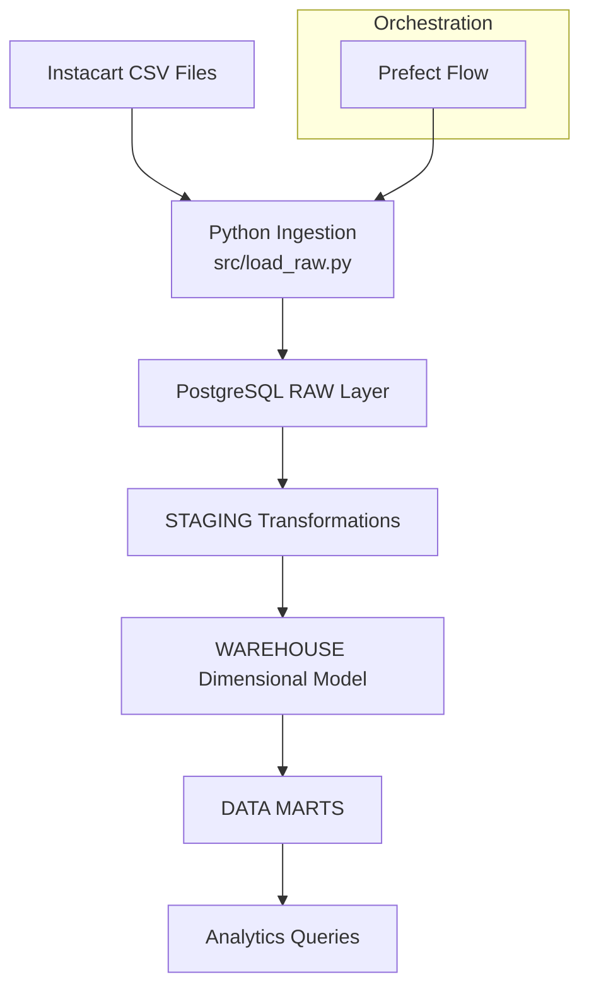

# Instacart Retail Analytics Warehouse Pipeline

This project builds an end-to-end data engineering pipeline that transforms the Instacart Online Grocery Shopping dataset into a structured PostgreSQL analytics warehouse.

The pipeline loads raw CSV data, cleans and models it, and produces analytics-ready data marts for business insights.


## Pipeline Architecture

The warehouse follows a layered architecture:



## Technologies

Python
PostgreSQL
SQLAlchemy
Prefect
Pandas
Dimensional Data Modeling

## Project Structure

```text
config/
data/
flows/
sql/
    raw/
    staging/
    warehouse/
    marts/
src/
tests/
README.md
requirements.txt
```
---

## Data Model

### RAW
- raw_orders
- raw_products
- raw_aisles
- raw_departments
- raw_order_products_prior
- raw_order_products_train

### STAGING
- stg_orders
- stg_products
- stg_order_items

### WAREHOUSE
- dim_orders
- dim_products
- dim_aisles
- dim_departments
- fact_order_items

### MARTS
- mart_product_reorders
- mart_customer_orders
- mart_department_trends

---

## Pipeline Steps

1. Create raw tables
2. Load raw CSV data
3. Transform data into staging tables
4. Build dimensional warehouse tables
5. Generate analytics marts

---

## Dataset

Instacart Online Grocery Shopping Dataset 2017

https://www.kaggle.com/datasets/psparks/instacart-market-basket-analysis

---

## Example Analytics

The warehouse enables analysis such as:

- product reorder rates
- customer ordering behavior
- department purchasing trends
- shopping patterns by day and hour

---

## Running the Pipeline

1. Install dependencies

```
pip install -r requirements.txt
```

2. Configure database credentials

```
Create a `.env` file using `.env.example`.
```

3. Run the pipeline

```
python flows/instacart_flow.py
```

## Future Improvements

- Docker containerization
- Airflow orchestration
- Cloud deployment (Azure)
- Dashboard layer (Power BI / Metabase)