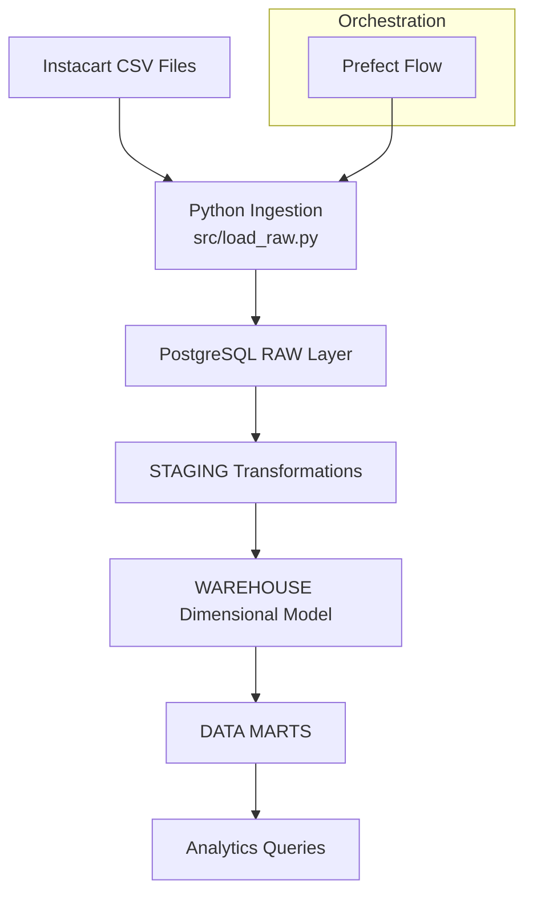
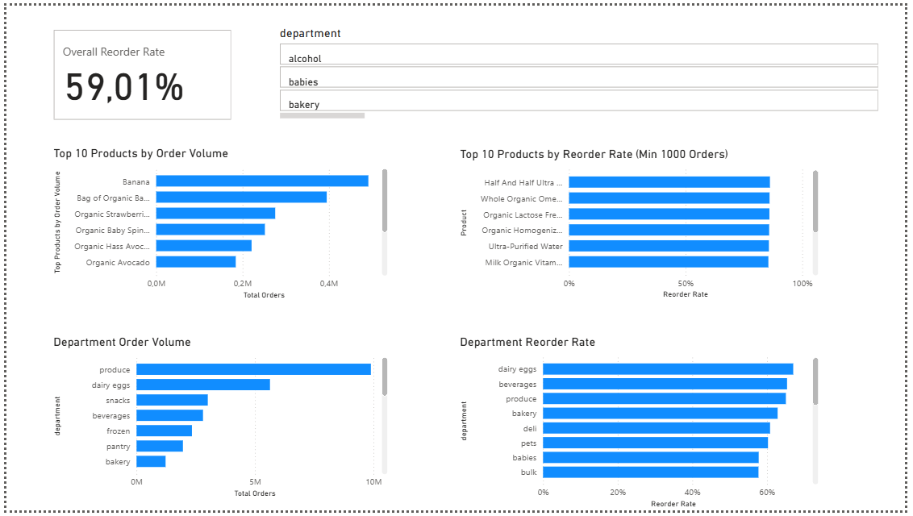
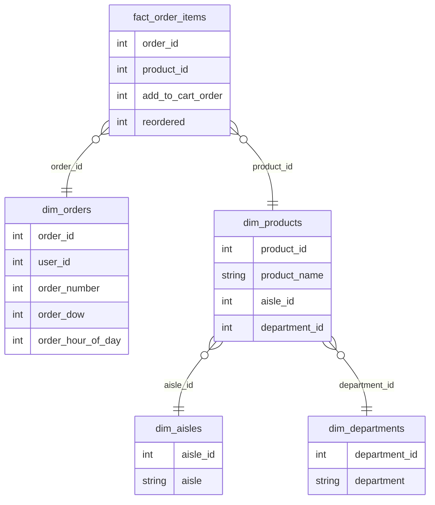

# Instacart Retail Analytics Pipeline (Azure + SQL + Power BI)

This project builds a cloud-based retail analytics pipeline on Azure to analyze customer purchasing and reorder behavior.

The goal is to identify:
- Which products drive demand
- Which products drive customer loyalty
- How reorder behavior differs across departments

The pipeline processes 33M+ records and transforms raw transactional data into business-ready insights through a structured data warehouse and Power BI dashboard.

It combines data engineering (pipeline, warehouse, orchestration) with analytics (metrics, dashboards) to demonstrate how raw data becomes actionable insights.

It includes two implementations:

- A PostgreSQL-based analytics warehouse (SQL-driven pipeline)
- A cloud-based Azure Data Lake pipeline (Python + storage-driven)

Both pipelines follow a layered architecture and produce structured data models and analytics-ready marts for business insights.

The final output is an interactive Power BI dashboard that enables business users to analyze demand vs customer loyalty across products and departments.

## 🚀 Azure Analytics Pipeline

This project includes a cloud-based implementation using:

- Azure Data Lake (storage)
- Azure Data Factory (ingestion)
- Azure SQL Database (warehouse)
- Power BI (analytics dashboard)

This version focuses on analyzing customer reorder behavior and product performance.

## Business Problem

Retail companies need to understand:

- Which products drive repeat purchases
- Which departments generate the most revenue
- How customer behavior impacts inventory planning

Without structured data, this information is difficult to extract from raw transactional data.

This project solves that by transforming raw order-level data into a structured analytics system that enables decision-making around:

- Inventory optimization
- Product performance tracking
- Customer purchasing behavior

## Key Features

- End-to-end data engineering pipeline for the Instacart Online Grocery Shopping dataset
- Processes **33M+ order item records** into a structured analytics warehouse
- Layered data architecture: **raw → staging → warehouse → marts**
- **Dimensional star schema** optimized for analytics queries
- Pipeline orchestration using **Prefect**
- Fully **containerized with Docker** for reproducible execution

## Pipeline Architecture

The pipeline ingests raw Instacart CSV files and transforms them into structured analytics models across both local (PostgreSQL) and cloud (Azure) environments.



The final output of the pipeline is an analytics-ready dataset consumed in Power BI.

The dashboard provides:

- High-level KPIs (total products, total orders, reorder rate)
- Top-performing products based on demand and reorder behavior
- Department-level performance analysis

This bridges the gap between data engineering and business decision-making.

## 📊 Power BI Dashboard

The Power BI dashboard provides a business-facing analytics layer built on top of the warehouse.

Key capabilities:

- Identify top-performing products based on demand and reorder behavior
- Analyze department performance by total orders and reorder rate
- Explore product-level metrics through an interactive table
- Filter insights dynamically using department slicers

This allows stakeholders to quickly answer:

- Which products drive repeat purchases?
- Which departments show strong customer loyalty?
- Where should inventory focus be increased or reduced?



## 📈 Key Insights

- Overall reorder rate is ~59%, indicating strong repeat purchase behavior across the platform

- High-volume products (e.g., bananas, produce) dominate total demand, driven by frequent consumption

- High reorder-rate products differ from high-volume products, highlighting strong loyalty in staple goods such as dairy and beverages

- Produce drives volume, while categories like dairy eggs and beverages drive repeat purchases

- This shows that demand and customer retention are not always aligned, which has implications for inventory and promotion strategy

## ⚡ Azure Data Lake Pipeline

This project also includes a cloud-native data pipeline built on Azure Blob Storage.

This implementation demonstrates a modern data engineering approach using a data lake instead of a traditional database warehouse.

Key capabilities:

- Raw data stored in Azure (data lake)
- Data processing using Python (Pandas)
- Warehouse modeling (dimensions + fact tables)
- Analytics marts generation
- Orchestration using Prefect with retry logic

## ☁️ Azure Architecture

Raw CSV → Azure Data Lake → Azure Data Factory → Azure SQL → Power BI

This architecture reflects a modern cloud data engineering workflow used in real-world retail analytics environments.

## Technologies

### Data Engineering
- Azure Data Factory
- Azure Data Lake Gen2
- Azure SQL Database
- PostgreSQL
- Prefect

### Analytics
- Power BI
- DAX

### Processing
- Python (Pandas)
- SQL

## Project Structure

```text
config/
data/
flows/
sql/
    raw/
    staging/
    warehouse/
    marts/
src/
tests/
README.md
requirements.txt
```
---

## Data Model

The warehouse follows a dimensional model with a central fact table for order items and supporting dimension tables.


---

## Key Metrics

- Total Orders
- Reorder Rate
- Product Score = total_orders × reorder_rate (used to rank high-demand, high-loyalty products)

## Pipeline Steps

1. Create raw tables
2. Load raw CSV data
3. Transform data into staging tables
4. Build dimensional warehouse tables
5. Generate analytics marts


---

## Dataset
The dataset contains anonymized customer orders, products, aisles, and departments, enabling analysis of purchasing patterns at scale.

Instacart Online Grocery Shopping Dataset 2017

https://www.kaggle.com/datasets/psparks/instacart-market-basket-analysis

---

## Example Analytics

The warehouse enables analysis such as:

- product reorder rates
- customer ordering behavior
- department purchasing trends
- shopping patterns by day and hour

---

## Running the Pipeline

1. Install dependencies

```
pip install -r requirements.txt
```

2. Configure database credentials

```
Create a `.env` file using `.env.example`.
```

3. Run the pipeline

```
python flows/instacart_flow.py
```
4. Using Make

```
make install
make run
```

## Pipeline Orchestration

The pipeline is orchestrated using Prefect, allowing monitoring of flow runs and task execution.


## Docker Pipeline Execution

The pipeline runs in Docker containers for reproducible local execution.

- PostgreSQL warehouse container
- Pipeline execution container


## Learnings

This project demonstrates:

- Building a layered data architecture (raw → staging → warehouse → marts)
- Designing dimensional models for analytics
- Creating business metrics using SQL and Power BI (DAX)
- Orchestrating pipelines using Prefect
- Structuring reproducible environments using Docker

It highlights how data engineering systems support real-world business decision-making.

## Future Improvements

- Expand Power BI dashboards with customer-level and time-based analysis
- Load Azure warehouse into PostgreSQL / Azure SQL
- Implement data quality checks
- Add monitoring and alerting
- Introduce scheduling for automated runs
