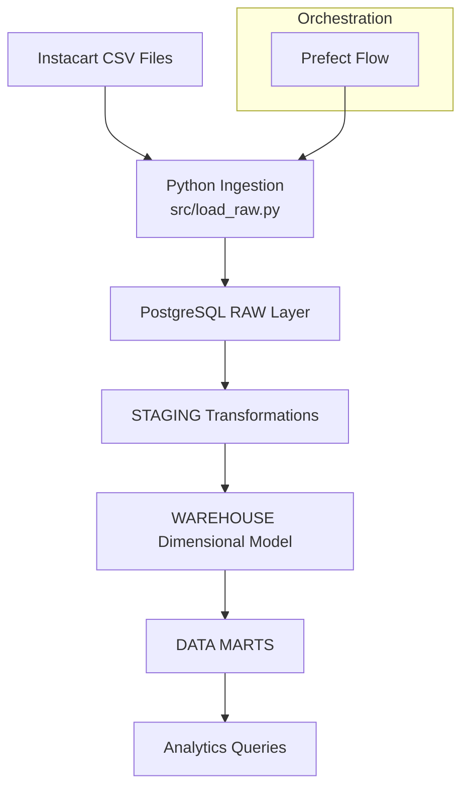
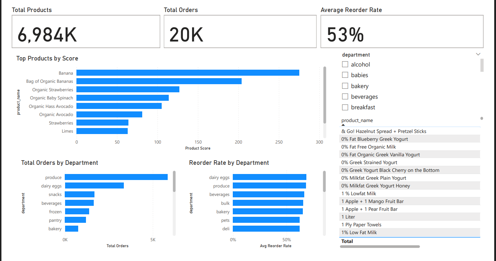
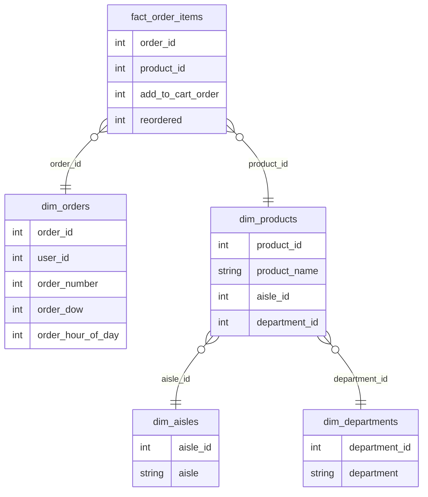
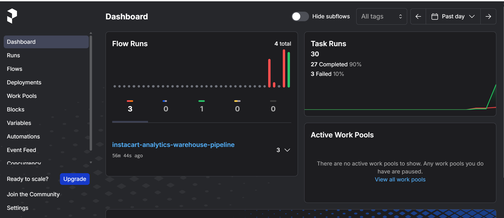

# Instacart Retail Analytics Warehouse Pipeline

This project builds an end-to-end data engineering system that transforms raw retail transaction data into a structured analytics platform for business insights.

The pipeline processes 33M+ records and enables analysis of product demand, reorder behavior, and department performance to support data-driven retail decision-making.

It combines data engineering (pipeline, warehouse, orchestration) with analytics (metrics, dashboards) to demonstrate how raw data becomes actionable insights.

It includes two implementations:

- A PostgreSQL-based analytics warehouse (SQL-driven pipeline)
- A cloud-based Azure Data Lake pipeline (Python + storage-driven)

Both pipelines follow a layered architecture and produce structured data models and analytics-ready marts for business insights.

## Business Problem

Retail companies need to understand:

- Which products drive repeat purchases
- Which departments generate the most revenue
- How customer behavior impacts inventory planning

Without structured data, this information is difficult to extract from raw transactional data.

This project solves that by transforming raw order-level data into a structured analytics system that enables decision-making around:

- Inventory optimization
- Product performance tracking
- Customer purchasing behavior

## Key Features

- End-to-end data engineering pipeline for the Instacart Online Grocery Shopping dataset
- Processes **33M+ order item records** into a structured analytics warehouse
- Layered data architecture: **raw → staging → warehouse → marts**
- **Dimensional star schema** optimized for analytics queries
- Pipeline orchestration using **Prefect**
- Fully **containerized with Docker** for reproducible execution

## Pipeline Architecture

The pipeline ingests raw Instacart CSV files, loads them into a PostgreSQL warehouse, and transforms them through layered schemas (raw → staging → warehouse → marts) orchestrated with Prefect.



The final output of the pipeline is an analytics-ready dataset consumed in Power BI.

The dashboard provides:

- High-level KPIs (total products, total orders, reorder rate)
- Top-performing products based on demand and reorder behavior
- Department-level performance analysis

This bridges the gap between data engineering and business decision-making.

## Dashboard

The Power BI dashboard provides a business-facing analytics layer built on top of the warehouse.

Key capabilities:

- Identify top-performing products based on demand and reorder behavior
- Analyze department performance by total orders and reorder rate
- Explore product-level metrics through an interactive table
- Filter insights dynamically using department slicers

This allows stakeholders to quickly answer:

- Which products drive repeat purchases?
- Which departments show strong customer loyalty?
- Where should inventory focus be increased or reduced?

## Dashboard Preview



## ⚡ Azure Data Lake Pipeline

This project also includes a cloud-native data pipeline built on Azure Blob Storage.

This implementation demonstrates a modern data engineering approach using a data lake instead of a traditional database warehouse.

Key capabilities:

- Raw data stored in Azure (data lake)
- Data processing using Python (Pandas)
- Warehouse modeling (dimensions + fact tables)
- Analytics marts generation
- Orchestration using Prefect with retry logic

Architecture:

Raw (Azure) → Processed → Warehouse → Marts

This complements the PostgreSQL pipeline by showing both database-driven and data lake-based architectures.

## Technologies

- Python
- PostgreSQL
- SQLAlchemy
- Prefect
- Docker
- Pandas
- Dimensional Modeling
- Azure Blob Storage (Data Lake)
- Pandas-based transformations (warehouse layer)

The analytics layer enables insights such as:

- High-frequency products (e.g., bananas, organic produce) dominate demand
- Produce is the highest-performing department by total orders
- Reorder behavior highlights strong customer loyalty in perishable goods
- Demand patterns are driven by frequently purchased everyday items

These insights can support decisions around inventory planning, promotions, and category management.


## Project Structure

```text
config/
data/
flows/
sql/
    raw/
    staging/
    warehouse/
    marts/
src/
tests/
README.md
requirements.txt
```
---

## Data Model

The warehouse follows a dimensional model with a central fact table for order items and supporting dimension tables.


---

## Key Metrics

- Total Orders
- Reorder Rate
- Product Score = total_orders × reorder_rate (used to rank high-demand, high-loyalty products)

## Pipeline Steps

1. Create raw tables
2. Load raw CSV data
3. Transform data into staging tables
4. Build dimensional warehouse tables
5. Generate analytics marts


---

## Dataset
The dataset contains anonymized customer orders, products, aisles, and departments, enabling analysis of purchasing patterns at scale.

Instacart Online Grocery Shopping Dataset 2017

https://www.kaggle.com/datasets/psparks/instacart-market-basket-analysis

---

## Example Analytics

The warehouse enables analysis such as:

- product reorder rates
- customer ordering behavior
- department purchasing trends
- shopping patterns by day and hour

---

## Running the Pipeline

1. Install dependencies

```
pip install -r requirements.txt
```

2. Configure database credentials

```
Create a `.env` file using `.env.example`.
```

3. Run the pipeline

```
python flows/instacart_flow.py
```
4. Using Make

```
make install
make run
```

## Pipeline Orchestration

The pipeline is orchestrated using Prefect, allowing monitoring of flow runs and task execution.



## Docker Pipeline Execution

The pipeline runs in Docker containers for reproducible local execution.

- PostgreSQL warehouse container
- Pipeline execution container


## Learnings

This project demonstrates:

- Building a layered data architecture (raw → staging → warehouse → marts)
- Designing dimensional models for analytics
- Creating business metrics using SQL and Power BI (DAX)
- Orchestrating pipelines using Prefect
- Structuring reproducible environments using Docker

It highlights how data engineering systems support real-world business decision-making.

## Future Improvements

- Expand Power BI dashboards with customer-level and time-based analysis
- Load Azure warehouse into PostgreSQL / Azure SQL
- Implement data quality checks
- Add monitoring and alerting
- Introduce scheduling for automated runs
